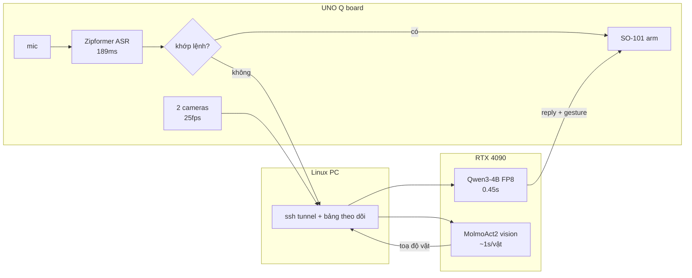

# Mira — voice-controlled SO-101 robot arm

Three machines: an Arduino UNO Q board (2GB RAM, aarch64) running the arm and the
full voice pipeline, a Linux PC used for monitoring and as the LAN bridge, and a
rented RTX 4090 used for the conversational LLM, TTS, and MolmoAct2 inference.

Start here: **[`docs/architecture.md`](docs/architecture.md)** for how the two
pipelines fit together, and **[`docs/benchmarks_board_vs_server.md`](docs/benchmarks_board_vs_server.md)**
for what each machine actually costs in measured milliseconds.

> **`windows-pc/` is a stale name.** That machine (an RTX 3070 Windows box at
> `192.168.1.32`) was retired on 2026-08-15 and a Linux PC at `192.168.1.48` took
> over its jobs. The directory keeps its name for now so paths in the older docs
> still resolve; the code inside it runs on Linux.

## Layout

- `board/` — code that runs directly on the UNO Q board.
  - `mira-so101-core/core/` — the `mira-robot` CLI (`teleop`, `replay <name>`,
    `calibrate`, `status`) and its minimal runtime (no torch/opencv).
  - `mira-so101-core/hf_lerobot/` — canned motion datasets (wave, dance, nod,
    shake, play-dead, bow, celebrate, shrug, point, curious-tilt, thinking, rest,
    scan) in LeRobot dataset format, plus the arm's calibration JSONs and the
    `calibration/snapshots/` history.
  - `calibrate_follower.py`, `calibrate_leader.py`, `read_follower_state.py` —
    standalone helpers that talk to the arms without the full LeRobot stack.
  - `camera_exporter.py` — stdlib-only Prometheus exporter that probes both
    cameras' ustreamer snapshots.
  - `start_mira.sh` — brings up everything the board runs, in dependency order.
    Nothing on the board survives a reboot except `bluetooth.service`, so this is
    the first thing to run after one.
- `windows-pc/voice-control/` — the wake-word → STT → motion pipeline.
  `board_voice_control.py` is the production path and runs natively on the board;
  `board_wakeword.py` and `wakeword_to_whisper.py` are retired earlier builds
  kept for reference.
- `windows-pc/monitoring/` — the live dashboard.
  - `live_dashboard.html` + `dashboard_server.py` — camera streams, wake/command
    counters, a peak-hold audio meter, and the live transcript. Runs on the PC,
    or on the board itself (`MIRA_BOARD=127.0.0.1 MIRA_BIND=0.0.0.0`) so a phone
    on the same WiFi can watch with no PC involved.
  - `prometheus.yml` + `dashboard.json` — Prometheus scrape config and the
    Grafana dashboard export, for history rather than live view.
- `server/` — scripts that run on the RTX 4090.
  - `mira_chat_server.py` — the conversational fallback: reply + gesture + an
    English manipulation task, spoken with Piper.
  - `molmoact2_server.py` — MolmoAct2 action inference. **Not in the live path**;
    its action head was measured to ignore the instruction.
  - `molmo_vision_server.py` — MolmoAct2's vision half over HTTP, which does
    work: it points at named objects in ~1s and feeds the dashboard's CV overlay.
- `tools/` — the scored eval harness (`eval_chat.py`, 86 cases) and benchmarks.
- `docs/` — module-level notes: hardware quirks, root-caused bugs, and the
  reasoning behind non-obvious decisions.

## What works, and what does not

| | status |
|---|---|
| Wake word + Vietnamese ASR, on-device | ✅ 189ms, no network hop |
| Canned motions from voice | ✅ 13 recorded gestures |
| Conversation (LLM + TTS + Bluetooth speaker) | ✅ 0.47–1.04s round trip, 95% on 86 eval cases |
| Object recognition by name | ✅ ~1s per object, drawn live on the dashboard |
| **Picking objects up** | ❌ blocked on one missing link — see below |
| Whole pipeline on the board alone | ❌ quality, not speed — see benchmarks |

The manipulation chain is three-quarters built: speech → English object name
(95%) → image coordinates (working) → **joint angles (missing)** → grasp. Both
off-the-shelf shortcuts were measured and rejected: MolmoAct2's action head is
indistinguishable from noise (1.18× signal-to-noise across contradictory
instructions, even on its own sample data), and `smolvla_base` needs fine-tuning
on your own teleop data by design.

The remaining link needs no model at all. The overhead camera is fixed, the table
is flat and the arm base does not move, so what is unknown is a single 2D map
from image coordinates to the joint angles that put the gripper above that point
— measurable by driving the arm through ~16 known poses and photographing each.

## Architecture

Two pipelines share the hardware. The voice one is in daily use; the vision one
sees but cannot yet act. Full diagrams, including the network constraints that
force this shape (the board cannot reach the internet except on port 443; the
rented server cannot reach the home LAN at all), are in
[`docs/architecture.md`](docs/architecture.md).



## Running it

After a board reboot:

```bash
ssh mira-board '~/start_mira.sh'          # cameras, exporters, dashboard, speaker, voice
```

On the Linux PC (needs the GlobalProtect VPN up for anything server-side):

```bash
ssh -N -L 192.168.1.48:8766:localhost:8766 -p 234 mira-4090 &   # chat path for the board
cd windows-pc/monitoring && python3 dashboard_server.py          # http://localhost:8090
```

On the 4090:

```bash
cd /data/qualcom-robotic && ./start_mira_stack.sh    # vLLM + chat server
```

Dashboard from a phone, no PC needed: `http://192.168.1.41:8088`.

## Not included

Virtualenvs, HuggingFace/model caches, the openWakeWord training data, and the
MolmoAct2 checkpoint are excluded — see `docs/gpu-training-server.md` and
`docs/uno-q-board.md` for how to regenerate or fetch them.
