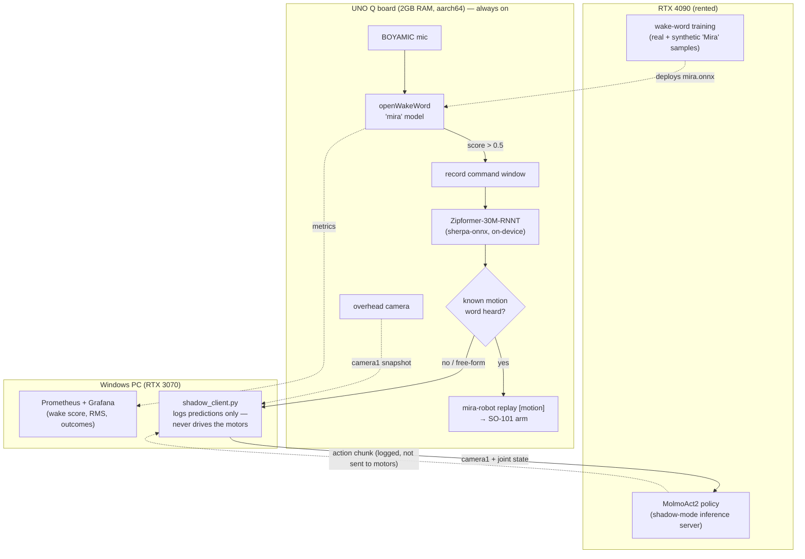

# Mira — voice-controlled SO-101 robot arm

Three machines: an Arduino UNO Q board (2GB RAM, aarch64) running the arm and
the full voice pipeline, a Windows PC (RTX 3070) used as a fallback/dev
machine and for monitoring, and a rented RTX 4090 server used for training
(wake-word model) and heavier inference (MolmoAct2).

## Layout

- `board/` — code that runs directly on the UNO Q board.
  - `mira-so101-core/core/` — the `mira-robot` CLI (`teleop`, `replay <name>`,
    `calibrate`, `status`) and its minimal runtime (no torch/opencv).
  - `mira-so101-core/hf_lerobot/` — canned motion datasets (wave, dance, nod,
    shake, play-dead, clean, scan) in LeRobot dataset format, plus the arm's
    calibration JSONs.
  - `calibrate_follower.py`, `read_follower_state.py` — standalone helpers
    that talk to the follower arm without needing the full LeRobot stack.
  - `camera_exporter.py` — stdlib-only Prometheus exporter for camera health.
- `windows-pc/voice-control/` — wake-word → STT → motion pipeline. Two
  variants: `board_wakeword.py` (runs natively on the board, no network hop —
  the current production path) and `wakeword_to_whisper.py` (the original
  Windows-side build, kept as a fallback). Both use a custom openWakeWord
  "mira" model (`mira.onnx`) and `hynt/Zipformer-30M-RNNT-6000h` via
  sherpa-onnx for Vietnamese STT.
  - `collect_mira_samples.py` — records real "Mira" positive samples from the
    board's own mic, for retraining the wake-word model on this user's voice.
  - `collect_voice_data.py` — records audio/text pairs across all command
    words, for measuring STT accuracy.
- `windows-pc/molmoact2-client/shadow_client.py` — shadow-mode inference
  client: sends a real camera frame + real joint state to the MolmoAct2
  server and logs predictions. **Never sends anything to the robot's
  motors.**
- `windows-pc/monitoring/` — Grafana dashboard export + Prometheus scrape
  config.
- `server/` — scripts that run on the RTX 4090 (wake-word training config,
  MolmoAct2 inference server, data-transfer helpers).
- `docs/` — module-level notes: hardware quirks, root-caused bugs, and the
  reasoning behind non-obvious decisions for each of the three machines.

## Architecture

Board listens continuously for the wake word → on trigger, records a short
command window and transcribes it locally → if it matches a known motion,
runs it directly on the arm (no network hop). This canned-command path is
fully board-native as of 2026-08-14. Harder/free-form instructions (e.g.
pick-and-place) are the intended fallback path to the RTX 4090's MolmoAct2
model — see `docs/gpu-training-server.md`.

The canned-command path (top loop) is the one actually driving the arm today.
The MolmoAct2 path exists and is verified end-to-end, but only in shadow
mode — it logs what it *would* do and never writes to the servos, since the
policy currently only has one working camera (the wrist camera is dead
hardware, see `docs/uno-q-board.md`).

## Not included

Virtualenvs, HuggingFace/model caches, the openWakeWord training data
(synthetic TTS clips + precomputed negative embeddings, tens of GB), and the
MolmoAct2 checkpoint are excluded — see `docs/gpu-training-server.md` and
`docs/uno-q-board.md` for how to regenerate/fetch them.
