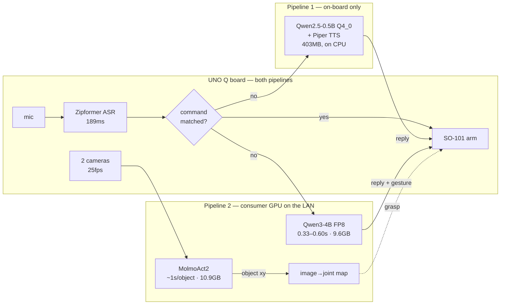

# Mira — voice-controlled SO-101 robot arm

Three machines: an Arduino UNO Q board (2GB RAM, aarch64) running the arm and the
full voice pipeline, a Linux PC used for monitoring and as the LAN bridge, and a
rented RTX 4090 used for the conversational LLM, TTS, and MolmoAct2 inference.

The 4090 is rented, but nothing here needs a rented card — see
[**Two ways to run this**](#two-ways-to-run-this) for the on-board-only pipeline
and the consumer-GPU VRAM tiers.

Start here: **[`docs/architecture.md`](docs/architecture.md)** for how the two
pipelines fit together, and **[`docs/benchmarks_board_vs_server.md`](docs/benchmarks_board_vs_server.md)**
for what each machine actually costs in measured milliseconds.

> **`windows-pc/` is a stale name.** That machine (an RTX 3070 Windows box at
> `192.168.1.32`) was retired on 2026-08-15 and a Linux PC at `192.168.1.48` took
> over its jobs. The directory keeps its name for now so paths in the older docs
> still resolve; the code inside it runs on Linux.

## Layout

- `board/` — code that runs directly on the UNO Q board.
  - `mira-so101-core/core/` — the `mira-robot` CLI (`teleop`, `replay <name>`,
    `calibrate`, `status`) and its minimal runtime (no torch/opencv).
  - `mira-so101-core/hf_lerobot/` — canned motion datasets (wave, dance, nod,
    shake, play-dead, bow, celebrate, shrug, point, curious-tilt, thinking, rest,
    scan) in LeRobot dataset format, plus the arm's calibration JSONs and the
    `calibration/snapshots/` history.
  - `calibrate_follower.py`, `calibrate_leader.py`, `read_follower_state.py` —
    standalone helpers that talk to the arms without the full LeRobot stack.
  - `camera_exporter.py` — stdlib-only Prometheus exporter that probes both
    cameras' ustreamer snapshots.
  - `start_mira.sh` — brings up everything the board runs, in dependency order.
    Nothing on the board survives a reboot except `bluetooth.service`, so this is
    the first thing to run after one.
- `windows-pc/voice-control/` — the wake-word → STT → motion pipeline.
  `board_voice_control.py` is the production path and runs natively on the board;
  `board_wakeword.py` and `wakeword_to_whisper.py` are retired earlier builds
  kept for reference.
- `windows-pc/monitoring/` — the live dashboard.
  - `live_dashboard.html` + `dashboard_server.py` — camera streams, wake/command
    counters, a peak-hold audio meter, and the live transcript. Runs on the PC,
    or on the board itself (`MIRA_BOARD=127.0.0.1 MIRA_BIND=0.0.0.0`) so a phone
    on the same WiFi can watch with no PC involved.
  - `prometheus.yml` + `dashboard.json` — Prometheus scrape config and the
    Grafana dashboard export, for history rather than live view.
- `server/` — scripts that run on the RTX 4090.
  - `mira_chat_server.py` — the conversational fallback: reply + gesture + an
    English manipulation task, spoken with Piper.
  - `molmoact2_server.py` — MolmoAct2 action inference. **Not in the live path**;
    its action head was measured to ignore the instruction.
  - `molmo_vision_server.py` — MolmoAct2's vision half over HTTP, which does
    work: it points at named objects in ~1s and feeds the dashboard's CV overlay.
- `tools/` — the scored eval harness (`eval_chat.py`, 86 cases) and benchmarks.
- `docs/` — module-level notes: hardware quirks, root-caused bugs, and the
  reasoning behind non-obvious decisions.

## What works, and what does not

| | status |
|---|---|
| Wake word + Vietnamese ASR, on-device | ✅ 189ms, no network hop |
| Canned motions from voice | ✅ 13 recorded gestures |
| Conversation (LLM + TTS + Bluetooth speaker) | ✅ 0.47–1.04s round trip, 95% on 86 eval cases |
| Object recognition by name | ✅ ~1s per object, drawn live on the dashboard |
| **Picking objects up** | ❌ blocked on one missing link — see below |
| Whole pipeline on the board alone | ❌ quality, not speed — see benchmarks |

The manipulation chain is three-quarters built: speech → English object name
(95%) → image coordinates (working) → **joint angles (missing)** → grasp. Both
off-the-shelf shortcuts were measured and rejected: MolmoAct2's action head is
indistinguishable from noise (1.18× signal-to-noise across contradictory
instructions, even on its own sample data), and `smolvla_base` needs fine-tuning
on your own teleop data by design.

The remaining link needs no model at all. The overhead camera is fixed, the table
is flat and the arm base does not move, so what is unknown is a single 2D map
from image coordinates to the joint angles that put the gripper above that point
— measurable by driving the arm through ~16 known poses and photographing each.

## Two ways to run this

Pick by the hardware you have. Both drive the same arm and the same 13 canned
motions; they differ in where the language and vision models run, and therefore
in what the robot can say and see.

### Pipeline 1 — end-to-end on the board

Everything on the UNO Q. No PC, no server, no network beyond the LAN. Mic → ASR
→ command match → arm, and for anything the matcher misses, a 0.5B LLM and Piper
TTS running on the board's own CPU (`board/mira_chat_local.py`).

| | |
|---|---|
| Hardware | UNO Q board (2GB RAM, aarch64) — nothing else |
| LLM | Qwen2.5-0.5B **Q4_0**, 403MB, 20.09 tok/s prefill · 11.89 tok/s decode |
| ASR | Zipformer-30M int8, 189ms |
| Vision | none |
| Grasping | no |

`Q4_0` is not a typo for the more common `Q4_K_M` — it measured *faster* on this
CPU (llama.cpp repacks it for ARM) at a smaller size. Full table in
[`docs/benchmarks_board_vs_server.md`](docs/benchmarks_board_vs_server.md).

The catch is quality, not speed. A 0.5B model answers, but not at the level the
86-case eval expects, and `cache_prompt` is mandatory — without it the 1231-token
system prompt costs ~70s per turn on this CPU and the pipeline is unusable.

### Pipeline 2 — board + a consumer GPU

The board keeps mic, ASR, arm and cameras. A GPU box on the same LAN runs the
conversational LLM and the vision model. This is the path that can grasp,
because it is the only one that produces object coordinates.

| | measured on RTX 4090 (24.5GB) |
|---|---|
| LLM | Qwen3-4B-Instruct-2507 **FP8** via vLLM — 0.33–0.60s, **9.6GB VRAM** |
| Vision | MolmoAct2 — 0.84–1.63s per object, **10.9GB VRAM** |
| Both resident | **20.5GB** |
| Grasping | yes, once the image→joint calibration map is in place |

**VRAM tiers.** 20.5GB is why the current box is a 24GB card. To fit smaller
cards you have to stop running both models at full precision:

| Card | How | Status |
|---|---|---|
| **24GB** | FP8 LLM + MolmoAct2, both resident | ✅ measured |
| **12GB** | 4-bit LLM (AWQ/GPTQ) + 4-bit MolmoAct2, both resident | ⚠️ estimated ~8–9GB, **not yet measured** |
| **8GB** | every large model at its smallest quant, and load LLM/vision **one at a time** | ⚠️ estimated, **not yet measured** |

The 12GB and 8GB rows are arithmetic, not benchmarks. Everything else in this
repo is measured; treat those two as a plan to verify, not a result.

Full diagrams, including the network constraints that force this shape (the board
cannot reach the internet except on port 443; the rented server cannot reach the
home LAN at all), are in [`docs/architecture.md`](docs/architecture.md).



## Running it

Common to both pipelines, after a board reboot — nothing on the board survives
one except `bluetooth.service`:

```bash
ssh mira-board '~/start_mira.sh'          # cameras, exporters, dashboard, speaker, voice
```

Dashboard from a phone, no PC needed: `http://<board-ip>:8088`.

### Pipeline 1 — on-board only

Not started by `start_mira.sh` yet; run it by hand on the board. `cache_prompt`
is what makes this viable at all:

```bash
/llm/llama-b10444/llama-server -m /llm/qwen2.5-0.5b-instruct-q4_0.gguf \
    -t 4 -c 2048 --host 127.0.0.1 --port 8099 &
python3 ~/mira_chat_local.py              # serves /chat on :8770
```

Needs on the board: `/llm/llama-b10444/llama-server`,
`qwen2.5-0.5b-instruct-q4_0.gguf`, the Piper voice
`vi_VN-vais1000-medium.onnx`, and both prompt files `/llm/mira_sys.txt` +
`/llm/mira_fewshot.txt`.

### Pipeline 2 — board + GPU box

On the Linux PC (needs the GlobalProtect VPN up for anything server-side):

```bash
ssh -N -L $PC_LAN_IP:8766:localhost:8766 gpu-box &   # chat path for the board
cd windows-pc/monitoring && python3 dashboard_server.py          # http://localhost:8090
```

On the GPU box:

```bash
cd /data/qualcom-robotic && ./start_mira_stack.sh    # vLLM + chat server
```

### Switching between the two

`board_voice_control.py` posts to a single `CHAT_SERVER_URL` constant. Point it at
whichever chat backend you are running:

| Pipeline | `CHAT_SERVER_URL` |
|---|---|
| 1 — on-board | `http://127.0.0.1:8770/chat` |
| 2 — GPU box | `http://<pc-lan-ip>:8766/chat` |

`start_mira.sh` brings up cameras, exporters, dashboard, speaker and voice.
Pipeline 1's two services are started separately, as shown above.

## Not included

Virtualenvs, HuggingFace/model caches, the openWakeWord training data, and the
MolmoAct2 checkpoint are excluded — see `docs/gpu-training-server.md` and
`docs/uno-q-board.md` for how to regenerate or fetch them.
