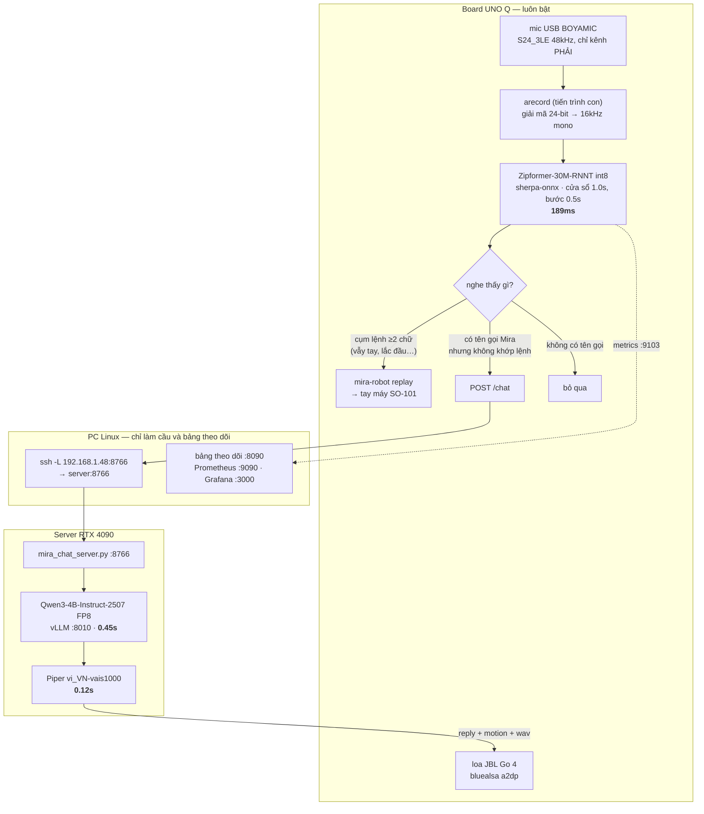
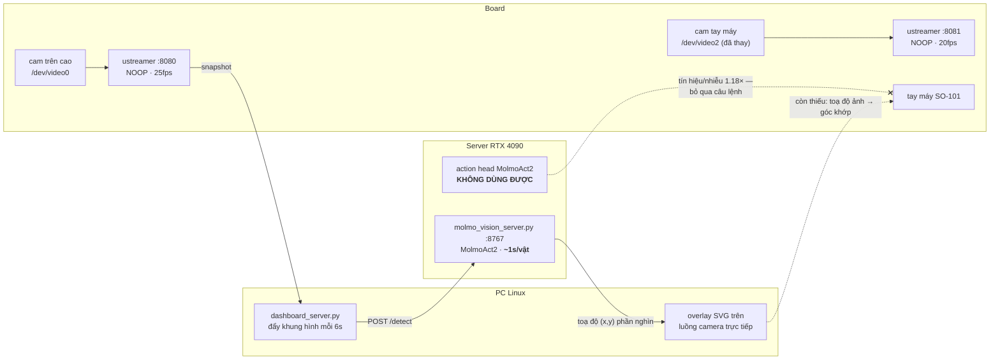

# Kiến trúc hệ thống Mira

Cập nhật 16/08/2026. Hai đường ống chạy song song trên cùng phần cứng: **đường
giọng nói** (đã chạy thật, dùng hằng ngày) và **đường thị giác** (nhìn được, chưa
gắp được). Cuối tài liệu là hai hình dạng triển khai: có server và không server.

## Máy móc

| | vai trò | trạng thái |
|---|---|---|
| **Board** Arduino UNO Q<br>`192.168.1.41` | nghe, nhận dạng tiếng, điều khiển tay máy, camera, bảng theo dõi | chạy 24/7 |
| **PC Linux** `192.168.1.48` | bảng theo dõi, Prometheus/Grafana, giữ tunnel SSH sang server | thay cho PC Windows đã hưu (`192.168.1.32`) |
| **Server** RTX 4090<br>`61.28.228.23:234` | LLM (vLLM), TTS, MolmoAct2 | máy thuê, **chỉ vào được qua VPN GlobalProtect** |

Ràng buộc mạng quyết định toàn bộ hình dạng hệ thống:

- **Board không ra được internet ngoài cổng 443** — không tự nối tới server được.
  Mọi thứ nó cần từ server phải đi qua PC trong LAN.
- **Server không với ngược vào LAN nhà được** — nên PC phải là bên mở tunnel
  (`ssh -L`), và ảnh camera phải được **đẩy** lên server chứ server không kéo về.

## Đường 1 — giọng nói và hội thoại

Đây là đường đang chạy thật.



**Trọn vòng đo được: 0.47 – 1.04s.**

`mira_chat_server.py` không chỉ trả lời. Nó còn:

1. **chọn cử chỉ** — chạy lượt thứ hai (`choose_gesture()`, greedy) trên câu trả
   lời đã xong. Làm cả hai việc trong một lượt thì kết quả gần như bừa.
2. **trích lệnh thao tác** — sinh trường `task` bằng tiếng Anh đúng mẫu
   `"pick up the <vật> and put it on the table"`, là dạng MolmoAct2 được huấn luyện.
3. **tự chặn lệnh sai** — `TASK_SHAPE` bỏ task không đúng mẫu, `TASK_VAGUE` bỏ task
   khi người dùng chỉ nói "cái đó" mà không gọi tên vật.

Đo bằng `tools/eval_chat.py`: **95% (82/86 ca)**.

## Đường 2 — thị giác và thao tác



Trạng thái từng mắt xích:

| mắt xích | trạng thái |
|---|---|
| giọng nói → tên vật tiếng Anh | ✅ chạy, 95% |
| tên vật → toạ độ trên ảnh | ✅ chạy, ~1s, hiện trên bảng theo dõi |
| toạ độ ảnh → góc khớp tay máy | ❌ **mắt xích duy nhất còn thiếu** |
| gắp | ❌ chuỗi script, chưa viết |

Đã đo và loại bỏ hai đường tắt: action head của MolmoAct2 (nhiễu, xem
`benchmarks_board_vs_server.md`) và `smolvla_base` (phải fine-tune mới dùng được).

Đường còn lại **không cần huấn luyện gì**: camera cố định + mặt bàn phẳng + đế tay
máy cố định ⇒ ẩn số chỉ còn một phép ánh xạ 2D. Đo bằng cách cho tay máy chạy qua
~16 tư thế đã biết, chụp ảnh mỗi lần, fit ánh xạ. Rồi gắp = lên trên vật → mở kẹp
→ hạ xuống → kẹp → nhấc.

## Hai hình dạng triển khai

### A. Có server (đang dùng)

```
board ──LAN── PC Linux ──ssh tunnel──▶ RTX 4090
 nghe          cầu nối                LLM 4B + TTS + thị giác
 nói           bảng theo dõi
 cử chỉ
```

Hội thoại **0.45s**, chất lượng **95%**. Cần VPN và máy thuê.

### B. Chỉ một board (đã đo, chưa đủ chất lượng)

```
board ─── tất cả tại chỗ ───  điện thoại xem qua WiFi
 nghe · nói · cử chỉ · camera · bảng theo dõi :8088
```

| thành phần | trên board | ghi chú |
|---|---|---|
| ASR | ✅ 189ms | đã chạy sẵn |
| TTS Piper | ✅ 1.04s | 60MB, nhanh 2× thời gian thực |
| Cử chỉ, camera, bảng theo dõi | ✅ | bảng chỉ tốn 14MB |
| LLM 0.5B Q4_0 | ⚠️ 3.8–4.8s | **cần cache prompt**, không thì 71.6s |
| Chất lượng hội thoại | ❌ 2/4 đúng | nhại few-shot, phá quy tắc |

Chặn lại ở **chất lượng**, không phải tốc độ. Hướng gỡ: distill từ teacher 4B —
vừa nâng chất lượng model nhỏ, vừa xoá luôn prompt 1231 token (khoản chi lớn nhất
trên CPU này). Nguyên liệu đã có sẵn: teacher 95%, bộ eval 86 ca, và hàng trăm câu
người dùng nói thật trong `voice_run.log`.

## Sống sót qua reboot

| | tự khởi động lại? |
|---|---|
| `bluetooth.service` trên board | ✅ đã `systemctl enable` |
| Mọi thứ khác trên board | ❌ chạy `board/start_mira.sh` |
| Tunnel + bảng theo dõi trên PC | ❌ chạy tay |
| vLLM + chat server trên 4090 | ❌ chạy `start_mira_stack.sh` |
